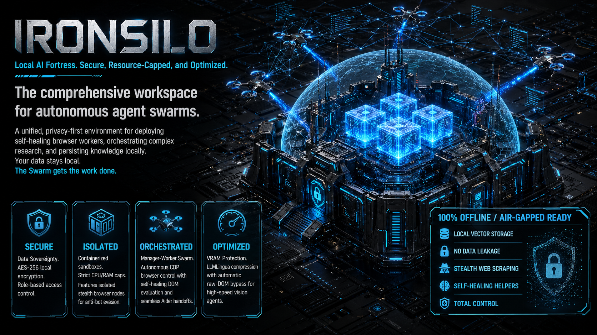

  

  
  
  
  
  

**Turn your PC into a private, autonomous AI lab, without melting your GPU.**

IronSilo is a completely local, cross-platform (Windows, macOS, Linux) AI development sandbox. It packages a state-of-the-art coding assistant, a wiki RAG engine, an autonomous WebAssembly agent, and a context-compression proxy into a single, resource-capped environment. 

It runs on low-to-mid spec machines by strictly limiting background RAM to ~4GB, dedicating 100% of your GPU to your actual AI model.

---

## 📦 What's in the Box?

This workspace utilizes a **Hybrid-Sandbox Architecture** to keep you secure without breaking your workflow:

**The Action Layer (Runs Locally for File Access):**
* **Aider (VS Code Extension):** Your AI pair programmer. It runs inside your editor so it can natively read and write to your local project files, but all of its AI traffic is securely tunneled directly into the Sandbox Proxy.
* **IronClaw (WASM Sandbox):** Your autonomous background agent. It runs natively to avoid lag, but strictly executes all browser and automation tasks inside its own secure WebAssembly (WASM) sandbox.

**The Intelligence Layer (Locked in Docker Container):**
* **Khoj:** Your private Wiki RAG engine. Drop in PDFs, markdown files, and notes, and ask your AI questions about them.
* **Genesys & pgvector:** The Long-Term Memory (LTM) database. This utilizes an active causal graph, allowing autonomous agents to remember your preferences and causal reasoning across sessions.
* **LLMLingua Proxy:** The central hub. It intercepts massive prompts and uses a tiny CPU model to compress the text by up to 40% before sending it to your GPU, saving your VRAM from crashing. It also has the added benefit of Token Optimization.

---

## 🛠️ Step 0: Install Prerequisites

If you are starting from a fresh computer, you must install these core tools first:

### 1. The Core Environment
* **Git:** Aider requires Git to track code changes. Download at [git-scm.com](https://git-scm.com/downloads) (Linux: `sudo apt install git` or `sudo pacman -S git`).
* **Visual Studio Code:** The editor for this workspace. Download at [code.visualstudio.com](https://code.visualstudio.com/). You can also use vsCodium or Code-OSS.
(Standalone GUI Application is on RoadMap)

### 2. Docker (The Sandbox Engine)
You need Docker to run the background databases and proxies safely.
* **Windows & macOS:** Download and install [Docker Desktop](https://www.docker.com/products/docker-desktop/). *Windows users: Ensure WSL2 is enabled during installation.* Open the app and make sure it is running in your system tray.
* **Linux (Ubuntu/Debian):** Run `sudo apt install docker.io docker-compose-v2` and start the daemon with `sudo systemctl enable --now docker`.
* **Linux (Arch/CachyOS):** Run `sudo pacman -S docker docker-compose` and start the daemon with `sudo systemctl enable --now docker`.

### 3. A Local AI Host (The Brain)
You need a program running on your computer to host your AI model (we highly recommend downloading the **Qwen 2.5 Coder 7B** model). Install one of the following:
* **[LM Studio](https://lmstudio.ai/):** Best for Windows/Mac beginners. Features a great UI.
* **[Ollama](https://ollama.com/):** Best for command-line users. (Run `ollama run qwen2.5-coder`).
* **Lemonade:** Best for Arch Linux/AMD GPU users seeking maximum ROCm performance. (Arch users: `yay -S lemonade-bin`).

---

## 🟢 Quick Start

Once your prerequisites are installed, you are ready to go.

**Step 1: Start your AI Model**
Open your AI Host and start a local server. *(By default, our proxy looks for an AI running on port `8000`. See the 'Documentation' section below if using Ollama, which uses port `11434`).*

**Step 2: Boot the Workspace**
* **Windows:** Double-click `Start_Workspace.bat`
* **Mac/Linux:** Open a terminal in this folder and run `./Start_Workspace.sh`
*(Note: The very first time you do this, Docker will download the required tools. It will be instant next time).*

**Step 3: Code!**
1. Open this repository folder in **VS Code**.
2. A pop-up will ask you to "Install Recommended Extensions." Click **Yes**.
3. *That's it.* Our `.vscode` settings automatically wire Aider and Khoj directly into your secure Docker sandbox. Start chatting in the sidebars!
4. *(Optional)* Navigate to `http://127.0.0.1:8080` in your browser to chat with your IronClaw agent.

---

## 🔴 Shutting Down

When you are done working, get your computer's RAM back:
* **Windows:** Double-click `Stop_Workspace.bat`
* **Mac/Linux:** Run `./Stop_Workspace
